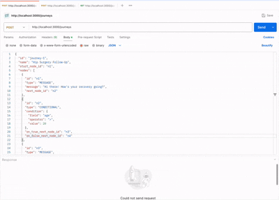

# 🧠 RevelAi Health - Journey Orchestration Engine

This project implements a simplified backend engine for orchestrating long-running patient care journeys. Each journey consists of steps like sending messages, waiting (delays), or branching based on patient data.

Built with **TypeScript**, **Express**, and an **in-memory store**, this solution provides:

- 🚀 API endpoints to define and trigger journeys
- ⚙️ Execution engine for processing `MESSAGE`, `DELAY`, and `CONDITIONAL` nodes
- 📊 Monitoring endpoint for journey progress
- ✅ Full test suite with unit + integration tests

---

## 🛠️ Setup Instructions

### 1. Clone & Install

```bash
git https://github.com/dinecaleb/revelai.git
npm install
```

> 📌 Make sure port **3000** is available. You can use Postman or cURL to test the API endpoints.

---

### 2. Run the Application

```bash
npm run dev
```

This will start the Express server at:  
**http://localhost:3000**

---

### 3. Test the Application

```bash
npm run test
```

This runs the Jest test suite, including:

- ✅ API endpoint tests (create, trigger, monitor journeys)
- ✅ Executor logic tests for `MESSAGE`, `DELAY`, and `CONDITIONAL` nodes

## 🎥 Demo (Bonus)



## Time spent

- 🕒 1 hour

## 🎥 Video recording url

https://drive.google.com/file/d/1uL1imbwxSjWhU3riW8fxKJhGMNMbpG3X/view?usp=sharing
